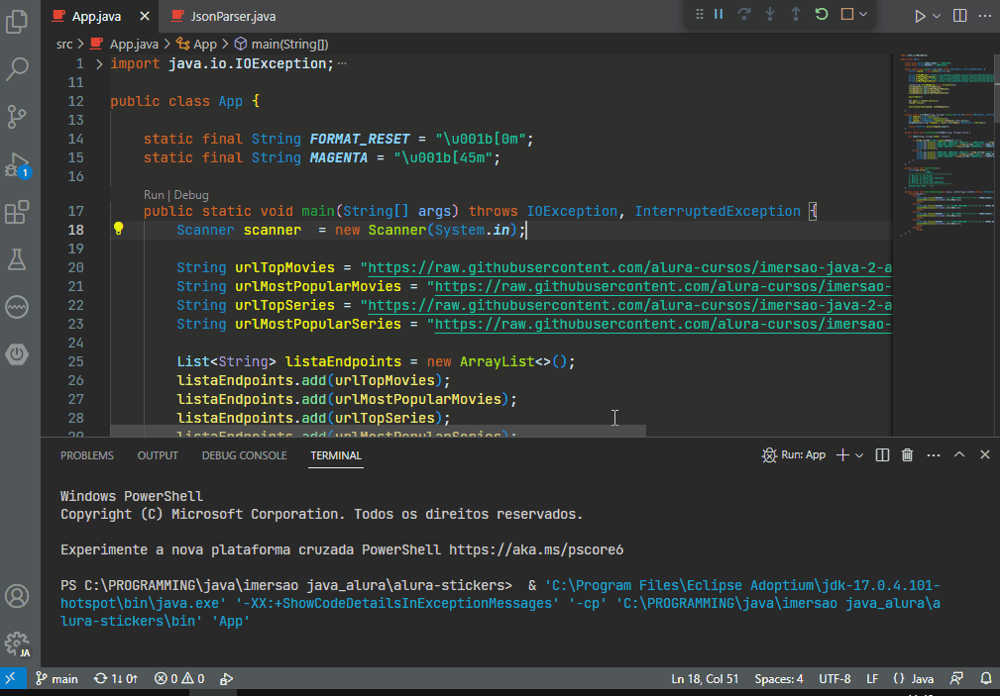
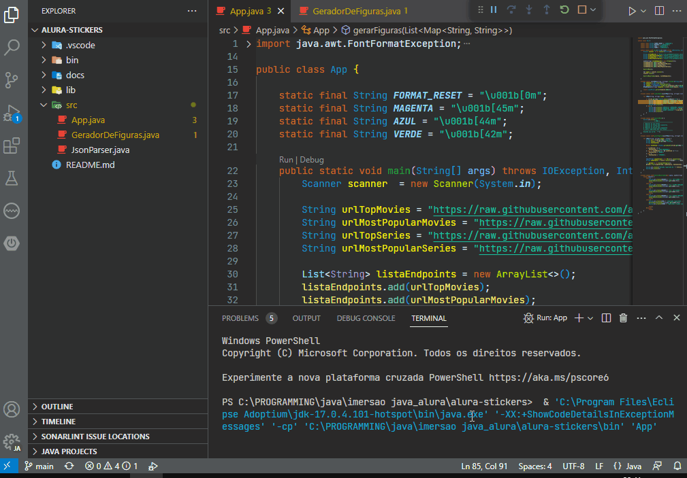

# Projeto Alura Imersão Java

Projeto em andamento, visando a prática com a linguagem Java e os conceitos do paradigma de orientação a objetos.
De início o projeto consome a API do IMDB. Consumindo alguns web-services, como: Top250 Movies, Top Series, além de filmes e séries mais populares. Agora o projeto é capaz de gerar stickers dos pôsters para WhatsApp, e outros.

:construction: Projeto em construção :construction:

## :hammer: Funcionalidades do projeto

- `Funcionalidade 1`: `Consome a API do IMDB e também a da Nasa`:

Extrair dados do JSON obtido e mostrá-los formatados (cores, emojis, etc) no console.

- `Funcionalidade 2`: `Gerar figurinhas para o WhatsApp, e outros`:

Gera imagens personalizadas em formato PNG através do pôster dos Top Filmes do IMDB. E também gera um texto sobre a imagem do pôster baseado na nota do filme.

## ✔️ Tecnologias utilizadas
- `Java 17`
- `VS Code`

## 📁 Acesso ao projeto

Você pode acessar e baixar os arquivos do projeto [aqui](https://github.com/paiva01/alura-stickers/tree/main/src)
